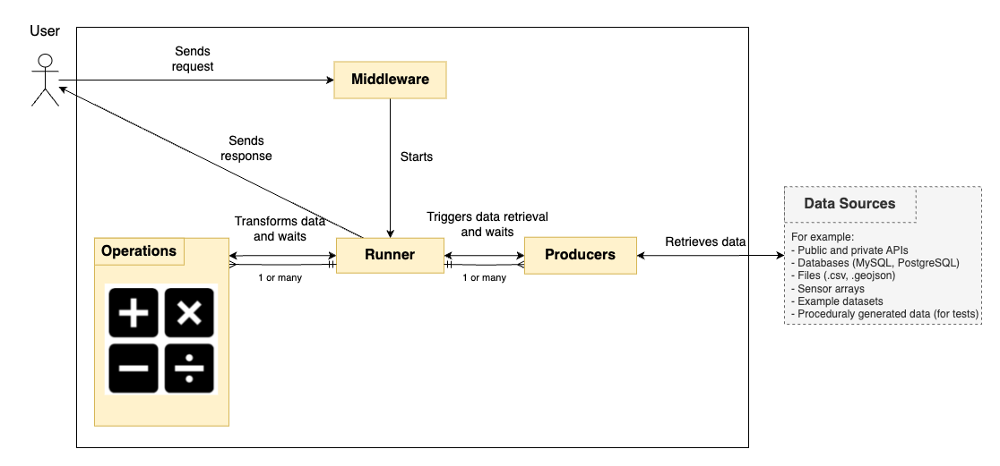

[](https://overbrowsing.com/projects/co2-shield)


The CITYdata middleware allows users to fetch, transform, and process data from various sources using Producers and Operations.

## What is it?
CITYdata is a part of the [TOOLS4CITIES](https://www.concordia.ca/research/cities-institute/initiatives/tools4cities.html) tool suite. It is a middleware that enables users to perform operations on data from different sources via the use of the following abstractions:

- Producer: connects to data sources and fetches data
- Operation: describes transformations to be performed on producer outputs (data)
- Runner: calls a series of producers, executes a series of operations on the producer's outputs, and then outputs the resulting data



You can see a more detailed breakdown of responsibilities for the middleware [here](./docs/architecture.png).

## What do I need?

- Java 21
- Maven version 3.7.x
- Postman (optional)

To collaborate with CITYdata, you can use the Java IDE of your choice. The CITYdata development team members use either Eclipse 2024-06 (4.32.0) or IntelliJ IDEA 2024.3.4.1.

## How do I set it up?

- Install Java and Maven in your operating system
- Open the terminal and check Java installation by typing "java --version". If Java is set up correctly, you should see the Java version printed on the terminal.

### Eclipse
- Open Eclipse. On the left-side menu, select Import > Maven > Existing Maven Projects.
- Select project directory: tools4cities-middleware.
- Click "Finish" and wait for the project to load.
- After loading, right-click the "middleware" folder, and select Maven > Update Project.
- Right-click again and select: Run As > maven install
- Right-click again and select: Run As > maven test

### IntelliJ
- Please follow the steps described [here](https://www.jetbrains.com/help/idea/import-project-from-eclipse-page-1.html).

### Command line
If you have mvn set up in the command line, go to the Middleware folder and run the following commands:
```bash
mvn dependency:purge-local-repository -DactTransitively=false -DreResolve=false
mvn clean
mvn validate
mvn install
```

As a result of the compilation, Maven will generate a JAR file. You can run it as follows:
```bash
java -jar ./target/Middleware-0.0.1-SNAPSHOT.jar --server.port=8080
```

## How do I use it?

- CITYdata is a REST API which receives queries as input and generates data as output.
- A query is a JSON file where you specify which data you want and which transformations you wish to apply to the data. You can see query examples in the folder /docs/examples.
- You can call CITYdata routes using your favourite programming language. For example, you can use the requests package in [Python](https://www.geeksforgeeks.org/get-post-requests-using-python/) or the fetch API in [JavaScript](https://developer.mozilla.org/en-US/docs/Web/API/Fetch_API/Using_Fetch).
- If you are familiar with Postman, you can use our Postman collection [here](https://github.com/ptidejteam/citydata/blob/master/Middleware/docs/citydata_collection.json) to send your queries, no need to write code.

The following routes are available:

| **Method** | **API Route URL**       | **Description**                                                                              | **Input**                        |
|------------|-------------------------|----------------------------------------------------------------------------------------------|----------------------------------|
| GET        | /producers/list         | Lists all Producers and their parameters                                                     |                                  |
| GET        | /operations/list        | Lists all Operations and their parameters                                                    |                                  |
| POST       | /apply/sync             | Executes query synchronously (will not return until completed)                               | A JSON query in the request body |
| POST       | /apply/async            | Executes query asynchronously (will return a runner ID instantly)                            | A JSON query in the request body |
| GET        | /apply/async/{runnerId} | Returns status of a runner ID. If the runner is completed, returns the prime Producer result | A runner ID                      |
| GET        | /apply/ping             | Returns pong (this is great to test if the middleware is running 😊)                          |                                  |
| POST       | /exists                 | Returns a list of prime Producers which match the given query                                | A JSON query in the request body |

For now, the number of Producers, Operations and parameters is quite limited, but we intend to expand it in the future and also document it better. Your suggestions are more than welcome!

## Who do I talk to?

Project manager: gabriel.cavalheiroullmann at concordia.ca

## Development Guidelines
- The develop branch is the working branch for CityData middleware developers. To integrate your changes, please create a new branch based on develop, apply your changes, then open a **pull request** and set develop as a target.
- One or more members of the CityData development team will **review every pull request** and provide improvement suggestions to the PR authors, if necessary.
- The CityData development team merges the develop branch into master **monthly** or whenever we have enough major features to justify a new release.
- All developers **must write tests** to demonstrate the correct usage of Producers and Operations while ensuring these classes function as intended.
